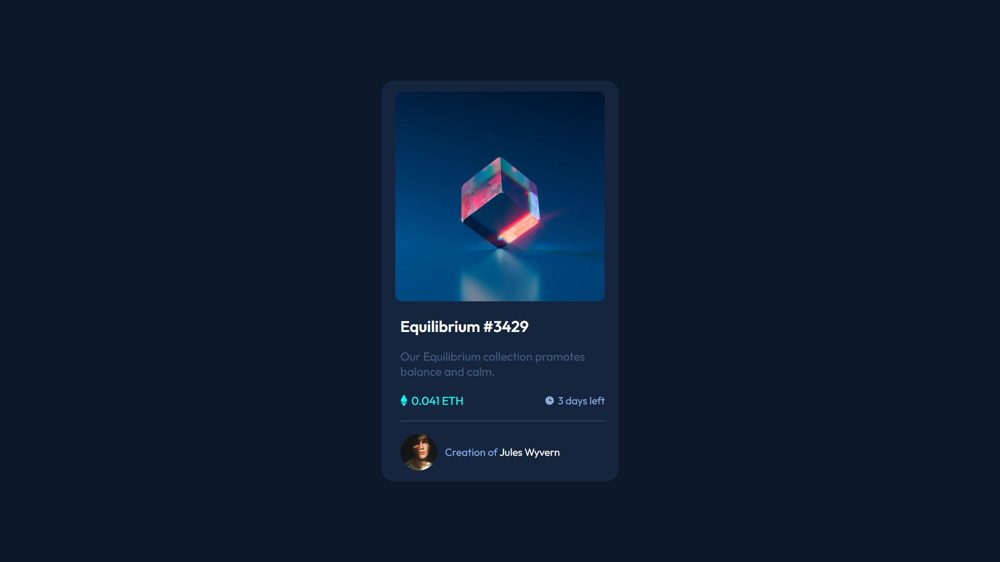
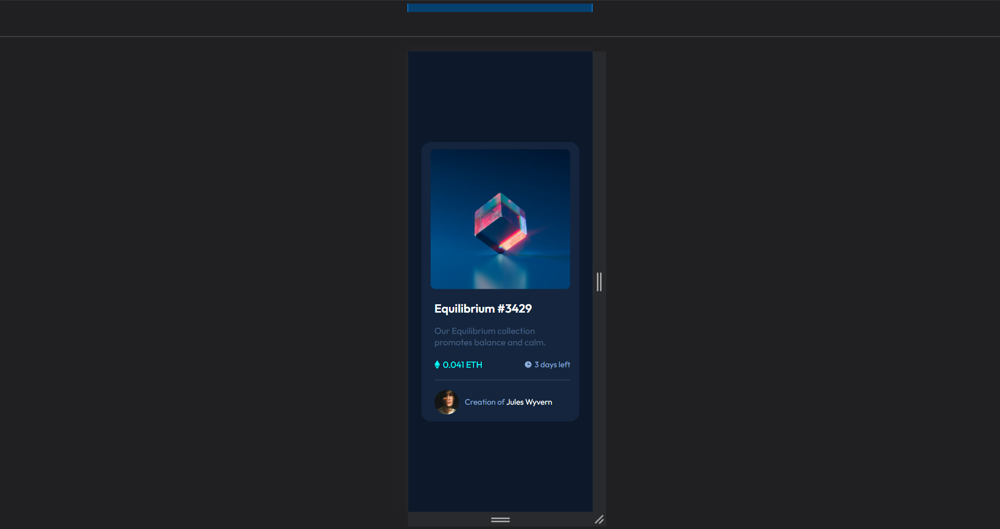

# NFT-Preview-Card-Component
# Frontend Mentor - NFT preview card component solution

This is a solution to the [NFT preview card component challenge on Frontend Mentor](https://www.frontendmentor.io/challenges/nft-preview-card-component-SbdUL_w0U). Frontend Mentor challenges help you improve your coding skills by building realistic projects. 

## Table of contents

- [Overview](#overview)
  - [The challenge](#the-challenge)
  - [Screenshot](#screenshot)
  - [Links](#links)
- [My process](#my-process)
  - [Built with](#built-with)
  - [What I learned](#what-i-learned)
  - [Continued development](#continued-development)
  - [Useful resources](#useful-resources)
- [Author](#author)

## Overview

### The challenge

Users should be able to:

- View the optimal layout depending on their device's screen size
- See hover states for interactive elements

### Screenshot




### Links

- Solution URL: [Add solution URL here](https://your-solution-url.com)
- Live Site URL: [Add live site URL here](https://your-live-site-url.com)

## My process

### Built with

- Semantic HTML5 markup
- CSS custom properties
- Flexbox

### What I learned

```html
<div class="nft-item">

      <div class="nft-banner">

        

      </div>

    <div class="nft-text-content">

      <h2 class="big-heading">Equilibrium #3429</h2>
      <p class="nft-description">Our Equilibrium collection promotes balance and calm.</p>

      <div class="nft-info">
        <p class="eth"> 0.041 ETH</p>
        <p class="time-left"> 3 days left</p>
      </div>

      <hr>

      <div class="creator-info">

        
        <p class="created-by">Creation of <span class="creator-name">Jules Wyvern</span></p>
      </div>

    </div>

    </div>
```
```css
.nft-info {
    display: flex;
    justify-content: space-between;
    margin: 1.4rem 0 0;
}

.eth {
    color: var(--cyan);
    display: flex;
    align-items: center;
    font-size: 1.1rem;
}

.ethereum-icon {
    padding: 0 6px 0 0;
}

.time-left {
    color: var(--soft-blue);
    display: flex;
    align-items: center;
}

.clock-img {
    padding: 0 4px 0 0;
}

/* Creator info */
.creator-info {
    display: flex;
    align-items: center;
    gap: 12px;
    margin: 1.2rem 0 0;
}

.creator-img {
    width: 18%;
}

.created-by {
    color: var(--soft-blue);
}

.creator-name {
    color: var(--white);
    cursor: pointer;
    transition: 0.4s ease;
}

/* Hover Status */

.big-heading:hover, .creator-name:hover {
    color: var(--cyan);
}

.nft-banner::after:hover {
    opacity: 1;
} 
```

### Continued development
1) Pseudo Elements

### Useful resources

- [MDN -> Pseudo Elements](https://developer.mozilla.org/en-US/docs/Web/CSS/::after)
- [Dev Ed](https://www.youtube.com/c/DevEd) 

## Author

- Website - [Add your name here](https://www.your-site.com)
- Frontend Mentor - [@AmanGupta1703](https://www.frontendmentor.io/profile/AmanGupta1703)
